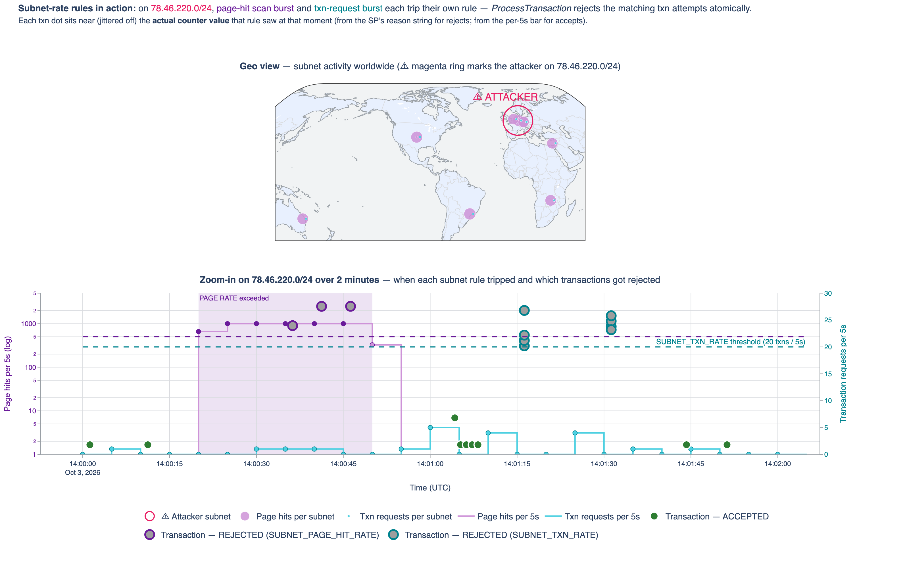
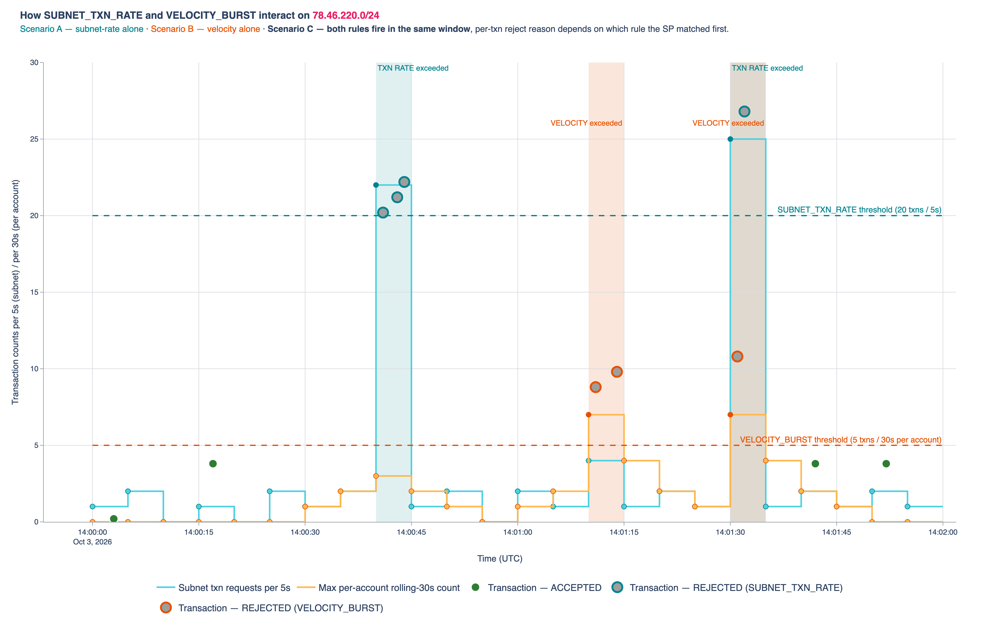

# beam-threat-detection

End-to-end example of the [VoltDB Apache Beam connector](https://central.sonatype.com/artifact/org.voltdb/voltdb-beam-io) running on Google Cloud Dataflow. Shows a real-time multi-source threat-detection system where **page-hit signals and transaction signals share a VoltDB counter** that the fraud-check stored procedure reads atomically — so a bot that scans a web site from one subnet gets its subsequent transaction from that same subnet rejected before the charge is executed.

> **Accompanying blog post:** [Multi-source threat detection on GCP with VoltDB + Apache Beam](https://medium.com/@mpopova/<PLACEHOLDER-REPLACE-WITH-MEDIUM-URL>) — walkthrough of the three-path architecture and how the connector plays each role. The charts below are the ones embedded in that post.

## What this example demonstrates

A real-time threat/fraud pipeline on GCP where:

- A Java microservice (`ThreatDetectionApp`) calls VoltDB stored procedures per transaction for atomic rule evaluation.
- A **Beam streaming pipeline on Dataflow** (`PageHitsIngestPipeline`) uses `VoltDbIO.write` to ingest high-volume page-hit events from PubSub into VoltDB's `SUBNET_REQUESTS` counter.
- A **Beam batch pipeline on Dataflow** (`ReportingPipeline`) uses `VoltDbIO.read` to pull new transactions out of VoltDB, enriches them with MaxMind GeoIP, and writes to BigQuery + an Apache Iceberg mirror on GCS for warehouse analytics.

Because page hits and transactions both write to the same per-subnet counter inside VoltDB, the transaction-processing SP sees the composite signal with per-request latency. A bot scan at 100 req/s pushes the subnet's hit counter past threshold within seconds, and the attacker's next transaction attempt from that subnet is rejected atomically — not minutes later from a dashboard.

## Charts

Both charts are produced by Jupyter notebooks under `notebooks/`. The PNG renders checked in under `notebooks/images/` are kept in sync with each notebook's current output so reviewers can see the current look without executing them.

**Chart 1 — subnet-rate rules timeline + world map:**


**Chart 2 — SUBNET_TXN_RATE and VELOCITY_BURST on one timeline:**


Each notebook has a `USE_BQ` toggle at the top: `True` queries the live warehouse tables for the attacker-subnet story, `False` uses hard-coded data that illustrates the same scenario shapes without any BigQuery dependency.

## Architecture — three real-time paths

```
── Path 1 — Transaction real-time ──────────────────────────────────
User request → ThreatDetectionApp → VoltDB SPs
                                      (RecordSubnetRequest → subnet count,
                                       ProcessTransaction  → ACCEPT/REJECT)
                SP results drive accept/reject + UI feedback

── Path 2 — Page-hits streaming ingest (Beam + connector) ──────────
PubSub topic (threat-page-hits)
    → PageHitsIngestPipeline (Beam streaming, Dataflow)
       → VoltDbIO.write("RecordSubnetRequest")
             fire-and-forget: return value ignored
             async pipelined: high-volume page hits saturate the write path

── Path 3 — Reporting + warehouse (Beam + connector + BQ + Iceberg) ─
./bin/run-reporting-pipeline.sh  (or Cloud Scheduler on a cadence)
    → ReportingPipeline (Beam batch, Dataflow)
       1. Watermark: SELECT MAX(TXN_TIME) FROM BigQuery.transactions
       2. VoltDbIO.read().withProcedure("ReadTxnsSince", watermark)
             SP output includes a server-side JOIN with ACCOUNTS + MERCHANTS
       3. GeoIP enrichment via MaxMind side input (GeoIpEnrichFn)
       4. Parallel sinks:
             ├─ BigQueryIO.write    → BigQuery.transactions (native)
             └─ Managed.ICEBERG     → gs://.../transactions/ (Iceberg mirror)
```

See `src/main/java/org/voltdb/example/threat/pipelines/` for the two Beam pipelines and `src/main/java/com/voltactivedata/example/threat/procedures/` for the VoltDB SPs.

## Repo layout

```
beam-threat-detection/
├── pom.xml
├── README.md                                   this file
├── bin/
│   ├── run-ingest-pipeline.sh                  launch Path 2 on Dataflow
│   ├── run-reporting-pipeline.sh               launch Path 3 on Dataflow
│   ├── run-narrative-scene.sh                  single-process demo scenario (NarrativeScene)
│   └── generate-page-hits.sh                   ad-hoc PageHitsGenerator wrapper
├── src/main/java/
│   ├── com/voltactivedata/example/threat/procedures/   VoltDB stored procedures (deployed into the cluster)
│   │   ├── ProcessTransaction.java             per-txn rule evaluator (atomic)
│   │   └── RecordSubnetRequest.java            counter writer (shared by Path 1 + Path 2)
│   └── org/voltdb/example/threat/
│       ├── common/                             PageHitEvent, CidrUtils, CsvDataLoader
│       ├── app/                                ThreatDetectionApp — Client2 wrapper for Path 1
│       ├── pipelines/                          PageHitsIngestPipeline, ReportingPipeline, GeoIpEnrichFn
│       └── generator/                          PageHitsGenerator, TransactionsGenerator, NarrativeScene
├── src/main/resources/
│   ├── voltdb-ddl.sql                          schema + materialised views for rate counters
│   ├── bigquery-ddl.sql                        warehouse tables (BQ native + BQ-Iceberg)
│   ├── data/                                   seed account + merchant CSVs + the URL catalog
│   └── application.properties.template         config placeholders
├── src/test/java/                              Testcontainer-backed integration tests (mvn verify)
└── notebooks/
    ├── chart1_subnet_rate_timeline.ipynb       subnet-rate rules + world map
    ├── chart2_txn_velocity_timeline.ipynb      SUBNET_TXN_RATE × VELOCITY_BURST interaction
    └── images/                                 committed PNG renders of both charts
```

## Prerequisites

- JDK 11+
- Maven 3.6+
- Docker (for the Testcontainer-backed integration tests)
- A VoltDB licence file. The pom pins `voltdb.image.version` in `src/test/resources/test.properties`.
- For GCP end-to-end runs only: a Google Cloud project with PubSub, Dataflow, BigQuery, GCS, and a BigQuery `CLOUD_RESOURCE` connection pointing at a GCS bucket (used by the Iceberg-formatted raw page-hit table). `gcloud auth application-default login` once per workstation.

## Running the tests locally

```bash
mvn verify
```

Runs unit tests and the Testcontainer-backed integration tests, which spin up a VoltDB container, load the schema + stored procedures, exercise `ThreatDetectionApp` end-to-end, and verify the ingest + reporting pipelines against a real VoltDB (sinks are mocked). No GCP access required.

## Running the demo on GCP

Provisioning (one-time: PubSub topics, BigQuery dataset + Iceberg-formatted table, VoltDB cluster on GKE, Dataflow prerequisites), day-to-day operations, and teardown are in [`RUNBOOK.md`](RUNBOOK.md). Copy `runbook.env.template` → `runbook.env`, edit, and `source` it before running the sections there.

With the infrastructure in place, the full flow is three commands:

```bash
# 1. Streaming ingest pipeline (long-running on Dataflow; one-time per demo cycle)
./bin/run-ingest-pipeline.sh

# 2. Fire the end-to-end narrative scenario (~2 min, publishes to PubSub + fires txns)
./bin/run-narrative-scene.sh

# 3. Report new VoltDB txns into BigQuery + Iceberg (~5 min, batch Dataflow)
./bin/run-reporting-pipeline.sh
```

Each script wraps `mvn exec:java` with the full argument list; override per-run defaults via env vars (see the comment headers in each `bin/` script).

Both notebooks under `notebooks/` can then be executed against the populated BigQuery tables (set `USE_BQ = True` in the first config cell).

## License

MIT — matches the rest of `voltdb-examples`.
